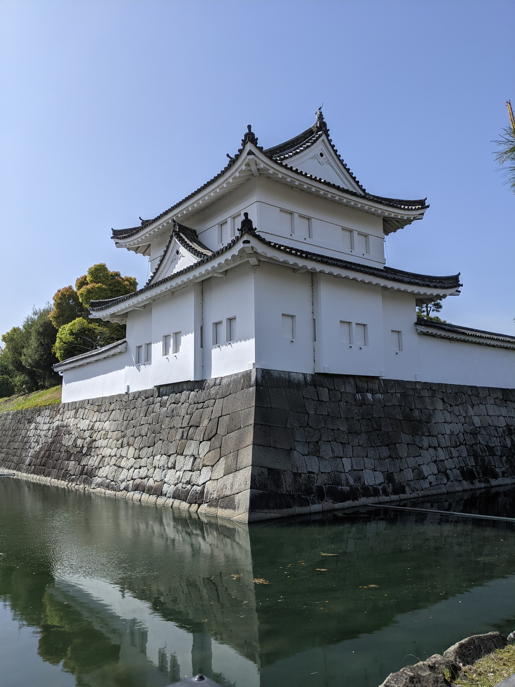
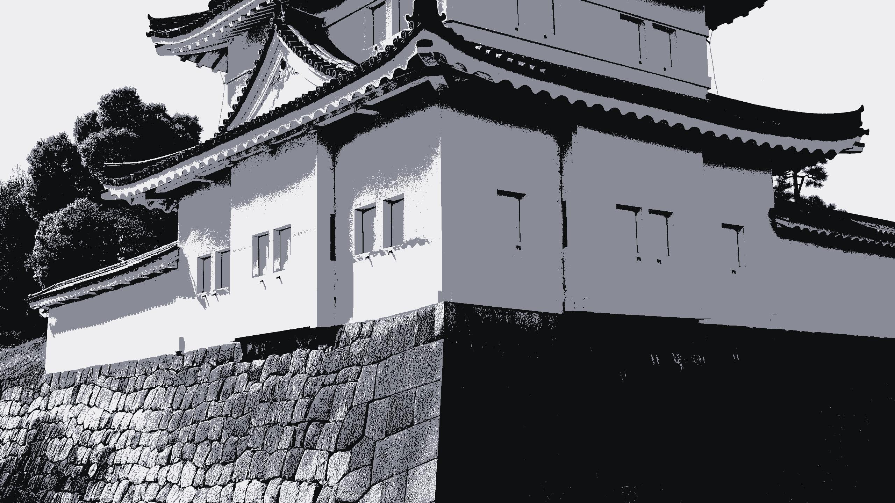
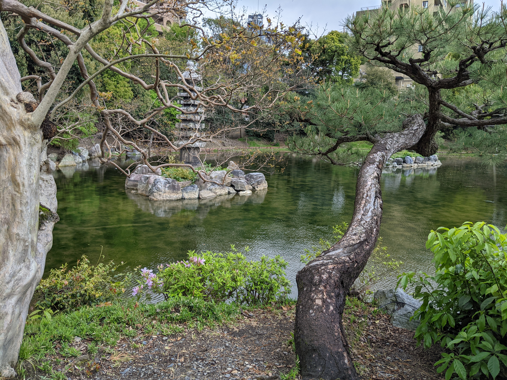
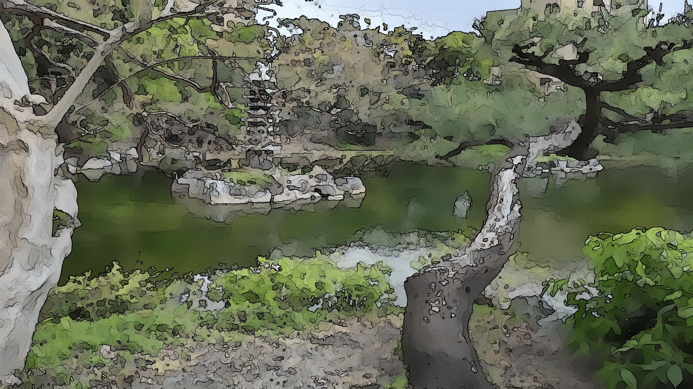
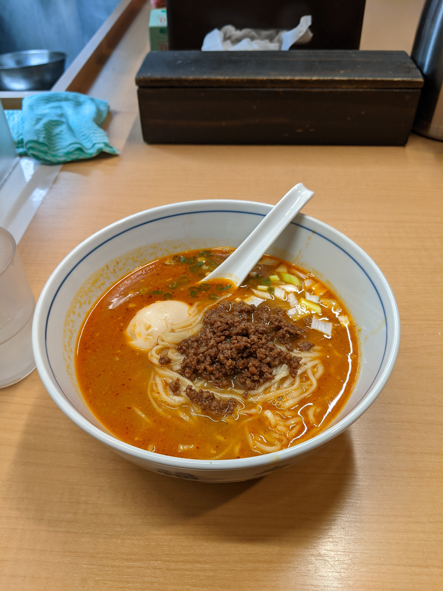
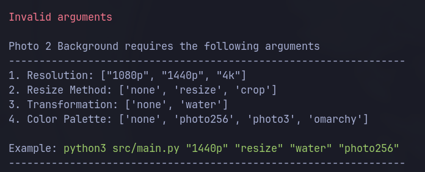
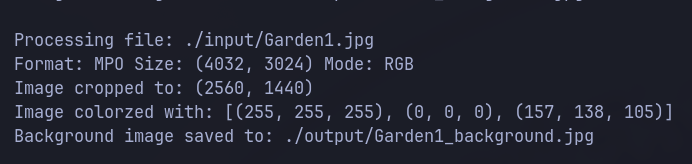

```
    ____  __          __           ___
   / __ \/ /_  ____  / /_____     |__ \
  / /_/ / __ \/ __ \/ __/ __ \    __/ /
 / ____/ / / / /_/ / /_/ /_/ /   / __/
/_/   /_/ /_/\____/\__/\____/   /____/

    ____             __                                    __
   / __ )____ ______/ /______ __________  __  ______  ____/ /
  / __  / __ `/ ___/ //_/ __ `/ ___/ __ \/ / / / __ \/ __  /
 / /_/ / /_/ / /__/ ,< / /_/ / /  / /_/ / /_/ / / / / /_/ /
/_____/\__,_/\___/_/|_|\__, /_/   \____/\__,_/_/ /_/\__,_/
                      /____/
```

The idea behind this project is to take a selection of real world photos I've taken and transform them into various stylized backgrounds. 

### Features
- Resize photo: 
  - Resize: Resizes photo to selected resolution. (Will stretch photo if not 16:9)
  - Crop: Center crop of photo to selected resolution. (Won't crop if photo is smaller than selected resolution)
- Transformation:
  - Water: Transforms photo with a watercolor effect
- Colorize: 
  - photo256: Reduces color palette of photo to 256 colors
  - photo3: Reduces color palette of photo to 3 colors and applies 3 colors from with a range found in the photo
  - omarchy: Reduces color palette of photo to 3 colors and applies 3 colors from the users omarchy color theme config. (Expects user to be using Omarchy, if not defaults to photo3)

Here are some examples that I like:
  
  
  

## Required Packages
- python3
- numpy==2.4.3
- opencv-python==4.13.0.92
- pillow==12.1.1
- pyfiglet==1.0.4

### Setup virtual environment
1. Open a terminal or command prompt and navigate to project directory

2. Create a virtual environment using the venv module:
  ```
python -m venv venv
```

3. Activate the virtual environment:
```
source .venv/bin/activate
```

4. Install the packages listed in requirements.txt:
```
pip install -r requirements.txt
```

5. Verify Installation: You can check the installed packages within your active environment by running:
```
pip list
```

6. Deactivate: When you are finished working in the environment, you can return to your system's global Python environment by running:
```
deactivate
```

## How to run
1. Within your virtual environment you can run cmd:
```
python3 src/main.py
```

2. You will be presented with help text for all available arguments


3. Place some photos in the input folder

4. Run the command again but this time with some valid args:
```
python3 src/main.py "1440p" "crop" "none" "omarchy"
```

5. Log messages will be display for each photo as they are processed


6. Navigate to the output folder to view the results

